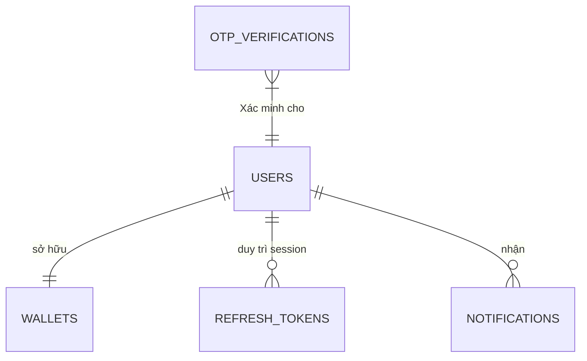

# Kiến trúc Hệ thống (System Architecture) - Phân hệ Chung (Common)

Phân hệ này đảm bảo tính **bảo mật (Security)**, **xác thực (Authentication)** và **giao tiếp (Communication)** trung tâm cho toàn bộ các vai trò khác.

---

### 1. Database Schema dành cho Phân hệ Chung (Auth & Notify)

---

### 2. Thiết kế luồng dữ liệu (Data Flows)

#### 2.1. Đăng ký tài khoản (Sign Up)
*   **Frontend:** `POST /api/v1/auth/register` (email/sđt, password, role).
*   **Backend:** 
    1. Kiểm tra tồn tại của Email/SĐT.
    2. **Hash Mật khẩu:** Sử dụng bcrypt/argon2 trước khi lưu.
    3. Tạo bản ghi User và **Ví (Wallet)** mặc định cho User đó.
    4. Gửi OTP qua SMS/Email (Job Queue).
*   **Database:** `INSERT INTO users (...)`; `INSERT INTO wallets (...)`.
*   **Kết quả:** Tài khoản được tạo ở trạng thái `INACTIVE` chờ xác thực OTP.

#### 2.2. Đăng nhập (Sign In)
*   **Frontend:** `POST /api/v1/auth/login` (credentials).
*   **Backend:** 
    1. Xác thực thông tin.
    2. Tạo cặp **Access Token (JWT)** và **Refresh Token**.
    3. Lưu Refresh Token vào DB/Redis để quản lý phiên bản đăng nhập.
*   **Database:** `SELECT * FROM users WHERE email = ...`; `INSERT INTO refresh_tokens (...)`.
*   **Kết quả:** Trả về Token và thông tin cơ bản của User (Profile) để Frontend lưu vào LocalStorage/State.

#### 2.3. Quên mật khẩu (Forgot Password)
*   **Luồng:**
    1. Khách gửi Email -> Backend tạo `Password_Reset_Token`.
    2. Gửi link reset có thời hạn (ví dụ 15 phút).
    3. Khách nhấn link -> Backend Verify Token -> Cho phép đổi Pass mới.
*   **Database:** `UPDATE users SET password = :new_hash WHERE id = ...`.

#### 2.4. Trung tâm thông báo (Notification Center)
Đây là luồng **Real-time** để báo đơn hàng mới, thay đổi giá, hoặc khuyến mãi.

*   **Frontend:** Kết nối **Websocket (Socket.io)** hoặc **Server-Sent Events (SSE)**.
*   **Backend:** 
    1. Khi có sự kiện (ví dụ: Đơn hàng mới).
    2. Một **Notification Service** tạo nội dung thông báo.
    3. Đẩy vào Database (để đọc lại sau) và đồng thời phát (Emit) qua Websocket cho User mục tiêu.
*   **Database:** `INSERT INTO notifications (user_id, content, is_read) VALUES (...)`.
*   **Kết quả:** Khách/Seller nhận thông báo "ting ting" ngay lập tức mà không cần load lại trang.

#### 2.5. Trang Thành công / Thất bại / 404
*   **Kiến trúc:** Đây chủ yếu là các **Functional Components** ở Frontend.
*   **Logic:**
    *   **Thành công (Success):** Nhận dữ liệu từ luồng trước đó (ví dụ Checkout) để hiển thị mã vận đơn.
    *   **404:** Xử lý tại Routing (React Router/NextJS) khi URL không khớp với bất kỳ Resource nào.
    *   **Thất bại (Error):** Backend trả về mã lỗi chuẩn (400, 401, 403, 500) kèm Message. Frontend hiển thị dựa trên mã lỗi đó.

---

### 3. Chính sách bảo mật (Security Policies)
*   **HTTPS/TLS:** Mã hóa toàn bộ đường truyền dữ liệu.
*   **Rate Limiting:** Chặn các cuộc tấn công Brute-force vào trang Đăng nhập (ví dụ: quá 5 lần sai/phút sẽ khóa tạm thời).
*   **CORS Policy:** Chỉ cho phép Frontend chính thức của sàn truy cập vào API.

---

### 4. Công nghệ đề xuất (Bổ sung cho Common)
*   **Identity Service:** Keycloak hoặc Auth0 (nếu muốn thuê ngoài) hoặc NestJS Identity (nếu tự xây dựng).
*   **Pub/Sub:** Redis Pub/Sub cho luồng thông báo Real-time nhẹ nhàng.
*   **Mail/SMS Service:** Twilio (SMS), SendGrid/Mailgun (Email).
