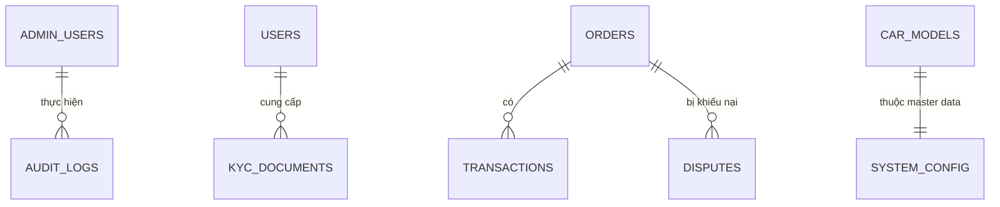

# Kiến trúc Hệ thống (System Architecture) - Phân hệ Quản trị (Admin)

Đây là "Trung tâm điều hành" của hệ thống, nơi đảm bảo tính minh bạch, bảo mật và vận hành thông suốt của toàn bộ sàn thương mại.

---

### 1. Database Schema dành cho Quản trị (Admin/Audit Tables)

Admin cần các bảng để kiểm soát và lưu vết (Audit Log) mọi hoạt động:

---

### 2. Thiết kế luồng dữ liệu (Data Flows)

#### 2.1. Quản trị Người dùng (KYC Approval)
*   **Frontend:** `GET /api/v1/admin/kyc/pending`.
*   **Backend:** Lấy danh sách Seller/Supplier đang chờ duyệt kèm ảnh CCCD/Giấy phép kinh doanh.
*   **Database:** `SELECT * FROM kyc_documents WHERE status = 'PENDING'`.
*   **Luồng Duyệt:** Admin gửi `PATCH /api/v1/admin/kyc/:id` (status: 'APPROVED').
    *   Backend cập nhật trạng thái User thành `ACTIVE` và kích hoạt gian hàng.

#### 2.2. Quản lý Sản phẩm (Content Moderation)
*   **Frontend:** Admin xem hàng đợi sản phẩm mới (`Product Approval Queue`).
*   **Backend:** 
    *   Áp dụng các Rules Filter (ví dụ: Chặn từ khóa cấm, kiểm tra trùng lặp ảnh).
    *   Khi Admin nhấn "Duyệt", Backend đẩy sản phẩm vào Search Engine (Elasticsearch) để khách có thể tìm thấy ngay.
*   **Database:** `UPDATE products SET is_approved = true, approved_at = NOW() WHERE id = :id`.

#### 2.3. Quản lý Giao dịch & Tài chính (Escrow & Settlement) - **Cốt lõi**
Đây là luồng dữ liệu khép kín để đảm bảo tiền không bị thất thoát.
*   **Luồng:**
    1. Khách thanh toán -> Tiền vào **Ví tổng của Sàn** (Sàn giữ tiền - Escrow).
    2. Backend tạo bản ghi `Transaction` trạng thái `HOLDING`.
    3. Khi đơn hàng thành công + hết hạn khiếu nại -> Backend chạy **Cron Job** quyết toán.
    4. Trừ phí sàn (Platform Fee %) -> Cộng tiền vào **Ví Seller**.
*   **Database:** `UPDATE wallets SET balance = balance + :amount_after_fee WHERE seller_id = :id`.
*   **Kết quả:** Minh bạch dòng tiền, Seller có thể làm lệnh rút tiền (Withdraw).

#### 2.4. Quản lý Tranh chấp (Dispute Resolution)
*   **Frontend:** Trang tổng hợp các đơn hàng bị khiếu nại.
*   **Backend:**
    *   Tổng hợp bằng chứng từ Khách (ảnh hàng hỏng) và Seller (ảnh lúc đóng gói).
    *   Admin ra phán quyết: `REFUND_TO_CUSTOMER` hoặc `PAY_TO_SELLER`.
*   **Database:** `UPDATE disputes SET resolution = :decision; UPDATE order SET status = ...`.
*   **Kết quả:** Tiền trong Escrow sẽ được giải phóng theo phán quyết của Admin.

#### 2.5. Cấu hình hệ thống (Master Data Management)
*   **Frontend:** Giao diện dạng cây (Tree) để quản lý Model xe, Mã lỗi.
*   **Backend:** 
    *   Xử lý logic Metadata (Dòng xe nào dùng mã lỗi nào).
    *   Lưu Cache (Redis) các cấu hình Master Data này vì chúng được gọi rất nhiều ở Front-store.
*   **Database:** `INSERT INTO car_models (make, model, year, trim, engine) VALUES (...)`.
*   **Kết quả:** Hệ thống có bộ dữ liệu chuẩn để Seller chọn khi đăng hàng.

---

### 3. Bảo mật và Lưu vết (Security & Audit)
Vì Admin có quyền can thiệp vào Tiền và Sản phẩm, mọi hành động phải được lưu vết:

*   **Audit Log:** Lưu mọi request `POST/PATCH/DELETE` từ Admin (Ai? Làm gì? Lúc nào? Giá trị cũ/mới?).
*   **Role-Based Access Control (RBAC):** 
    *   Admin Tài chính: Chỉ xem Giao dịch.
    *   Admin Nội dung: Chỉ duyệt Sản phẩm.
    *   Super Admin: Toàn quyền.

---

### 4. Công nghệ đề xuất (Bổ sung cho Admin)
*   **Monitoring:** Grafana + Prometheus để theo dõi sức khỏe hệ thống và lưu lượng giao dịch.
*   **Logging:** ELK Stack (Elasticsearch, Logstash, Kibana) để lưu và truy vấn Audit Log khổng lồ.
*   **Cơ chế duyệt:** Amazon Rekognition (AI) để hỗ trợ quét sơ bộ ảnh Chứng minh thư/Giấy tờ để phát hiện hàng giả/giấy tờ giả trước khi con người duyệt.
