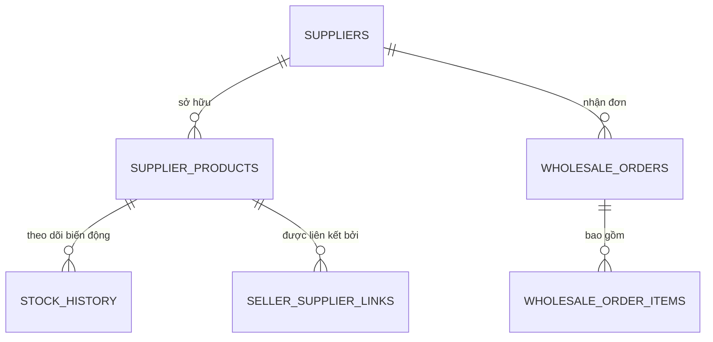

# Kiến trúc Hệ thống (System Architecture) - Phân hệ Nhà cung cấp (Supplier)

Trong phân hệ này, kiến trúc tập trung vào khả năng **xử lý dữ liệu lớn (Big Data Processing)** và **quản lý quan hệ đại lý (B2B Management)**.

---

### 1. Database Schema dành cho Nhà cung cấp (Supplier Tables)

Supplier cần các bảng đặc thù để quản lý kho sỉ và dữ liệu linh kiện gốc:

---

### 2. Thiết kế luồng dữ liệu (Data Flows)

#### 2.1. Quản lý Danh mục sỉ (Bulk Catalog Management)
*   **Frontend:** `POST /api/v1/supplier/products/upload` (file: .csv, .xlsx).
*   **Backend:** 
    1. Tiếp nhận file và đưa vào **Job Queue** (tránh treo server khi xử lý hàng chục nghìn mã hàng).
    2. Một **Parser Service** đọc file, validate mã OEM và chuẩn hóa thông tin dòng xe tương thích.
    3. Lưu vào Database và thông báo cho Supplier khi hoàn tất.
*   **Database:** `INSERT` hoặc `UPDATE` hàng loạt vào bảng `Supplier_Products`.
*   **Kết quả:** Danh mục sỉ khổng lồ được cập nhật trong vài phút.

#### 2.2. Quản lý Tồn kho & Giá sỉ (Price & Stock Update)
*   **Frontend:** `PATCH /api/v1/supplier/products/:id` (price_wholesale, stock_qty).
*   **Backend:** 
    *   Cập nhật thông tin gốc.
    *   Kích hoạt **Broadcast Event** tới tất cả các Seller đang link tới sản phẩm này (đã đề cập ở kiến trúc Seller).
*   **Database:** `UPDATE supplier_products SET ... WHERE id = :id`.
*   **Kết quả:** Giá sỉ mới được áp dụng ngay lập tức cho các đơn hàng tương lai.

#### 2.3. Quản lý Đơn nhập (Wholesale/Dropship Orders)
*   **Luồng nhập sỉ (Wholesale):** Seller mua số lượng lớn về kho riêng.
*   **Luồng Dropship:**
    *   **Backend:** Khi Seller có đơn từ Khách lẻ, hệ thống tự động đẩy Order tới Supplier.
    *   **Frontend (Supplier):** Nhìn thấy đơn ghi chú "Dropship", kèm nhãn vận chuyển (Shipping Label) đã in sẵn tên Shop của Seller.
*   **Database:** `SELECT * FROM wholesale_orders WHERE status = 'PENDING';`
*   **Kết quả:** Supplier đóng gói và bàn giao cho đơn vị vận chuyển mà không cần quan tâm đến khách lẻ.

#### 2.4. Thống kê đại lý (Agent Analytics)
*   **Frontend:** `GET /api/v1/supplier/analytics/sellers`.
*   **Backend:** 
    *   Truy vấn số lượng bản ghi trong `Seller_Supplier_Links`.
    *   Tính toán doanh thu/sản lượng theo từng Seller (Top đại lý).
*   **Database:** 
    `SELECT s.shop_name, COUNT(orders.id) as total_sales FROM sellers s JOIN wholesale_orders orders ON s.id = orders.seller_id ... GROUP BY s.id`.
*   **Kết quả:** Dashboad hiển thị biểu đồ tăng trưởng đại lý và các mặt hàng bán chạy nhất hệ thống.

---

### 3. Quy trình đồng bộ hóa (System Consistency)
Vì một mã OEM (ví dụ: má phanh Toyota) có thể có hàng trăm Seller đang bán:

*   **Logic:** 1 Supplier Product -> n Seller Products.
*   **Backend Task:** Khi `Supplier_Product.stock` = 0, hệ thống phải cập nhật trạng thái `OUT_OF_STOCK` cho n bản ghi của Seller trong vòng dưới 5 giây.
*   **Công nghệ:** Sử dụng **Event-Driven Architecture** (Kafka hoặc Redis Pub/Sub) để đảm bảo tính thời gian thực.

---

### 4. Công nghệ đề xuất (Bổ sung cho Supplier)
*   **File Processing:** AWS Lambda hoặc Worker riêng để xử lý Excel/CSV.
*   **Analytics:** Sử dụng **Materialized Views** trong SQL để tăng tốc độ truy vấn báo cáo thống kê đại lý.
*   **Notification:** Webhook gửi thông báo tới Seller khi Supplier có hàng mới hoặc thay đổi giá sỉ đột ngột.
