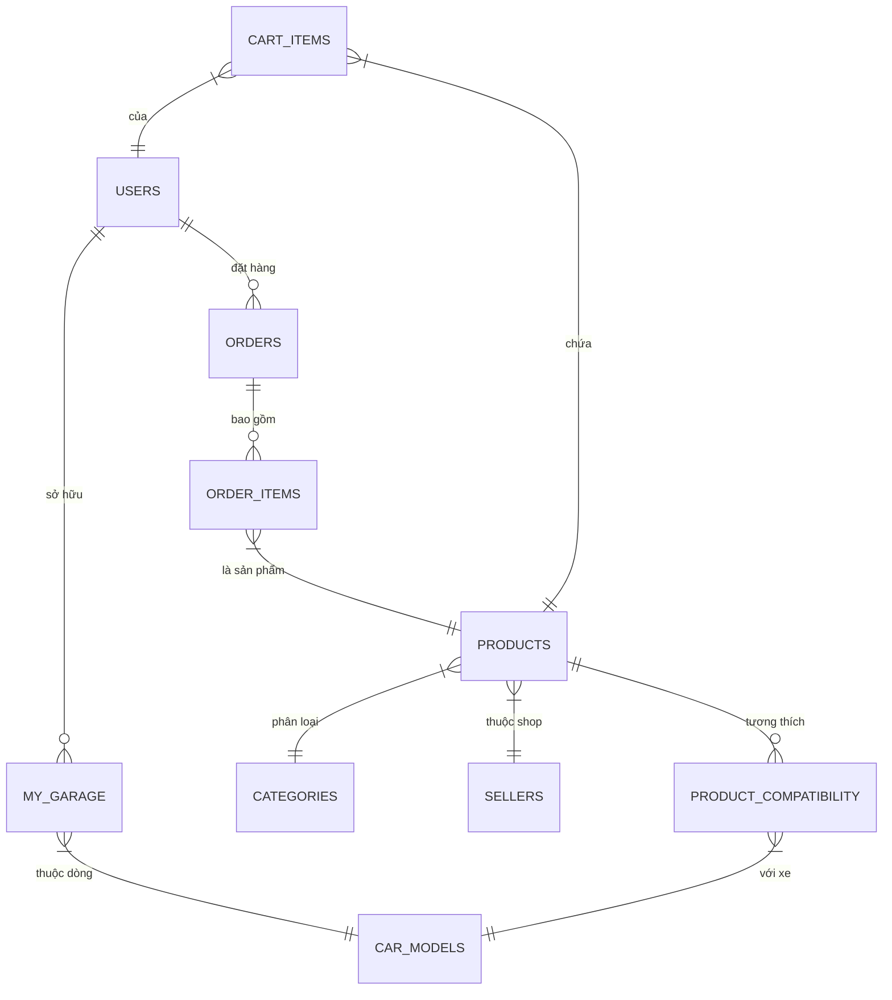

# Kiến trúc Hệ thống (System Architecture) - Phân hệ Khách hàng

Chào bạn, với vai trò **System Architect**, tôi sẽ thiết kế luồng dữ liệu và cấu trúc Database để đảm bảo hệ thống vận hành ổn định, chính xác và có khả năng mở rộng.

---

### 1. Sơ đồ thực thể Database (Core ERD)

Dưới đây là các bảng quan trọng nhất để vận hành luồng Khách hàng:

---

### 2. Thiết kế luồng dữ liệu (Data Flows)

#### 2.1. Trang chủ (Home Page)
*   **Frontend:** Gửi request `GET /api/v1/home`. Truyền thêm `user_id` (nếu đã login).
*   **Backend:** 
    *   Lấy danh sách Banner từ Cache/DB.
    *   Nếu có `user_id`, gọi Service gợi ý để lấy SP dựa trên xe trong "My Garage".
    *   Lấy danh mục cha (Categories).
*   **Database:** `SELECT` từ bảng `Banners`, `Categories`, và `Products` (limit theo đề cử).
*   **Kết quả:** JSON chứa cấu trúc trang chủ đồng nhất.

#### 2.2. Tìm kiếm & Lọc (Search & Filter) - **Quan trọng**
*   **Frontend:** Gửi `GET /api/v1/products?make=Toyota&model=Camry&year=2020&q=phanh`.
*   **Backend:** 
    *   Xử lý Search Engine (Elasticsearch hoặc Full-text search).
    *   **Logic lọc:** Join bảng `Products` với `Product_Compatibility`.
    *   Chỉ trả về linh kiện có `car_model_id` khớp với bộ lọc của khách.
*   **Database:** 
    `SELECT p.* FROM products p JOIN product_compatibility pc ON p.id = pc.product_id WHERE pc.car_model_id = :model_id AND p.name LIKE :query`.
*   **Kết quả:** Danh sách linh kiện "chắc chắn lắp vừa" xe của khách.

#### 2.3. Chi tiết sản phẩm (Product Detail)
*   **Frontend:** Gửi `GET /api/v1/products/:id`.
*   **Backend:** 
    *   Lấy thông tin SP, thông số kỹ thuật (JSON column).
    *   Lấy danh sách các đời xe tương thích (Compatibility List).
    *   Lấy đánh giá (Reviews) và thông tin Shop (Seller Info).
*   **Database:** `SELECT` cẩu nối 4-5 bảng: `Products`, `Sellers`, `Product_Compatibility`, `Reviews`.
*   **Kết quả:** Full dữ liệu SP và bằng chứng tương thích.

#### 2.4. Giỏ hàng (Cart)
*   **Frontend:** `POST /api/v1/cart/add` (product_id, quantity).
*   **Backend:** 
    *   Kiểm tra Tồn kho (`inventory`).
    *   Nếu SP thuộc Shop khác, nhóm theo `seller_id` trong giỏ.
*   **Database:** `UPSERT` vào bảng `Cart_Items`. 
*   **Kết quả:** Giỏ hàng cập nhật, hiển thị tách biệt theo từng Shop (Seller).

#### 2.5. Thanh toán (Checkout)
*   **Frontend:** `POST /api/v1/orders`.
*   **Backend:** 
    *   **Atomic Transaction (Giao dịch nguyên tử):**
        1. Check lại giá & tồn kho.
        2. Tạo bản ghi `Orders` và `Order_Items`.
        3. Giữ chỗ tồn kho (`Stock locking`).
        4. Gọi API Cổng thanh toán (VNPay/Momo).
    *   Xử lý Voucher/Khuyến mãi.
*   **Database:** `INSERT` vào `Orders`, `Order_Items`. `UPDATE` giảm `Inventory`.
*   **Kết quả:** Order ID và Link thanh toán.

#### 2.6. Quản lý đơn hàng (Order Tracking)
*   **Frontend:** `GET /api/v1/orders/:id`.
*   **Backend:** Join thông tin đơn hàng với Log vận chuyển.
*   **Database:** `SELECT` bảng `Orders` và `Order_Logs`.
*   **Kết quả:** Trạng thái: "Shop đang đóng gói", "Đang giao", "Đã đến bưu cục...".

#### 2.7. Hồ sơ & Gara của tôi (My Garage)
*   **Frontend:** `POST /api/v1/garage/add` (car_model_id, license_plate).
*   **Backend:** Lưu thông tin xe khách đang đi để cá nhân hóa việc tìm kiếm sau này.
*   **Database:** `INSERT` vào bảng `My_Garage`.
*   **Kết quả:** Xe được lưu vào Profile. Từ đây, Search mặc định sẽ ưu tiên xe này.

#### 2.8. Trung tâm trợ giúp/Khiếu nại (Dispute Center)
*   **Frontend:** `POST /api/v1/disputes` (order_id, reason, images).
*   **Backend:** 
    *   Chặn trạng thái "Hoàn tiền" cho Seller nếu có khiếu nại (Escrow Lock).
    *   Thông báo cho Admin và Seller.
*   **Database:** `INSERT` vào bảng `Disputes`. `UPDATE` trạng thái `Order` thành "In_Dispute".
*   **Kết quả:** Ticket hỗ trợ được tạo.

---

### 3. Công nghệ đề xuất
*   **Backend:** Node.js (NestJS) hoặc Golang (cho hiệu năng cao).
*   **Database:** PostgreSQL (xử lý dữ liệu quan hệ chặt chẽ).
*   **Cache:** Redis (lưu giỏ hàng, thông tin dòng xe Master Data).
*   **Search:** Elasticsearch (để tìm kiếm cực nhanh theo mã OEM/phụ tùng).
