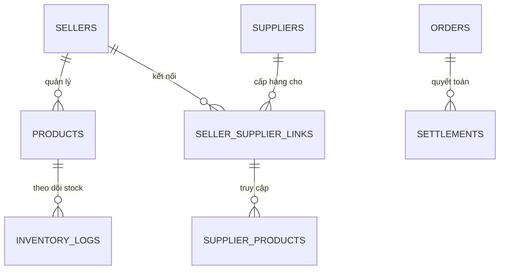

# Kiến trúc Hệ thống (System Architecture) - Phân hệ Người bán (Seller)

Trong phân hệ này, chúng ta tập trung vào **hiệu suất vận hành** và tính chính xác của **luồng cung ứng (Supply Chain)**.

---

### 1. Mở rộng Database Schema (Seller Extensions)

Ngoài các bảng cơ bản, Seller cần các bảng sau để quản lý nguồn hàng và kinh doanh:

---

### 2. Thiết kế luồng dữ liệu (Data Flows)

#### 2.1. Tổng quan (Dashboard)
*   **Frontend:** `GET /api/v1/seller/stats`.
*   **Backend:** 
    *   Tổng hợp doanh thu từ bảng `Settlements`.
    *   Đếm đơn mới từ `Orders` có trạng thái `PENDING`.
    *   Quét bảng `Inventory` để tìm SP có số lượng dưới ngưỡng `safety_stock`.
*   **Database:** 
    `SELECT SUM(amount) FROM settlements WHERE seller_id = :id AND created_at >= TODAY;`
*   **Kết quả:** JSON trả về các con số KPI để Seller nắm bắt tình hình kinh doanh ngay lập tức.

#### 2.2. Quản lý sản phẩm (Product Management)
*   **Frontend:** `GET /api/v1/seller/products?status=active`.
*   **Backend:** Lấy danh sách SP kèm trạng thái duyệt từ Admin (`is_approved`).
*   **Database:** `SELECT * FROM products WHERE seller_id = :id;`
*   **Kết quả:** Danh sách SP kèm cảnh báo nếu bị Admin từ chối hoặc yêu cầu sửa đổi.

#### 2.3. Đăng sản phẩm (Product Listing)
*   **Trường hợp 1 (Tự đăng):** Seller nhập tay toàn bộ.
*   **Trường hợp 2 (Link từ Supplier):**
    *   **Frontend:** Gửi `POST /api/v1/seller/products/link` (supplier_product_id, markup_price).
    *   **Backend:** Sao chép meta-data từ SP của Supplier sang bảng SP của Seller, giữ lại `link_id` để đồng bộ tồn kho.
*   **Database:** `INSERT INTO products (name, oem_code, price, supplier_link_id) SELECT name, oem_code, :markup_price, :link_id FROM supplier_products WHERE id = :supp_prod_id`.
*   **Kết quả:** SP mới xuất hiện trên sàn với giá bán lẻ của Seller.

#### 2.4. Quản lý Nguồn hàng (Sourcing)
*   **Frontend:** `GET /api/v1/seller/sourcing/suppliers?category_id=...`.
*   **Backend:** Tìm kiếm các Supplier có cung cấp linh kiện trong danh mục yêu cầu.
*   **Database:** `SELECT * FROM suppliers s JOIN supplier_categories sc ON s.id = sc.supplier_id ...`.
*   **Kết quả:** Danh sách Supplier, điểm uy tín và chính sách giá sỉ.

#### 2.5. Quản lý đơn hàng (Order Fulfillment)
*   **Frontend:** `PATCH /api/v1/seller/orders/:id/status` (status: 'CONFIRMED').
*   **Backend:** 
    *   Kiểm tra nếu là hàng Dropship: Tự động tạo đơn nhập sỉ gửi tới Supplier.
    *   Nếu hàng tại kho: Gọi API vận chuyển để lấy `tracking_number`.
    *   Tự động trừ tồn kho thực tế.
*   **Database:** `UPDATE orders SET status = 'CONFIRMED', shipping_code = :code ...`.
*   **Kết quả:** Thông báo cho Khách hàng là đơn đang được xử lý.

#### 2.6. Cài đặt Gian hàng (Store Settings)
*   **Frontend:** `PUT /api/v1/seller/shop-info`.
*   **Backend:** Cập nhật thông tin shop, hotline, và đặc biệt là **Chính sách đổi trả** (đặc thù linh kiện cần quy định rõ: "không được trầy xước", "còn nguyên tem").
*   **Database:** `UPDATE sellers SET shop_name = :name, return_policy = :policy ...`.
*   **Kết quả:** Thông tin cập nhật trên trang chi tiết Shop ở phía Khách hàng.

---

### 3. Cơ chế đồng bộ (Sync Mechanism)
Đây là phần khó nhất: **Đồng bộ Tồn kho và Giá sỉ.**

*   **Workflow:**
    1. **Supplier** cập nhật giá sỉ/tồn kho.
    2. Một **Webhook** hoặc **Message Queue (RabbitMQ)** được kích hoạt.
    3. **Background Worker** quét toàn bộ các `products` của Seller có `link_id` tới Supplier đó.
    4. Cập nhật lại tồn kho Seller và gửi cảnh báo nếu giá sỉ mới cao hơn giá bán lẻ của Seller.

---

### 4. Công nghệ đề xuất (Bổ sung cho Seller)
*   **Worker:** Sidekiq (Ruby) hoặc BullMQ (Node.js) để xử lý đồng bộ tồn kho hàng loạt.
*   **Storage:** S3/MinIO để lưu ảnh chụp linh kiện/vận đơn lúc đóng gói (đối chứng khi có khiếu nại).
*   **Reporting:** ClickHouse hoặc MongoDB để lưu vết lịch sử tồn kho (Inventory Logs) phục vụ báo cáo.
